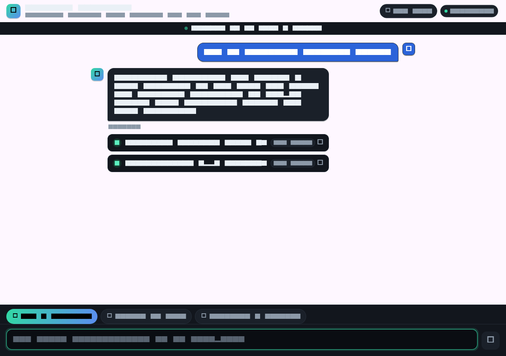
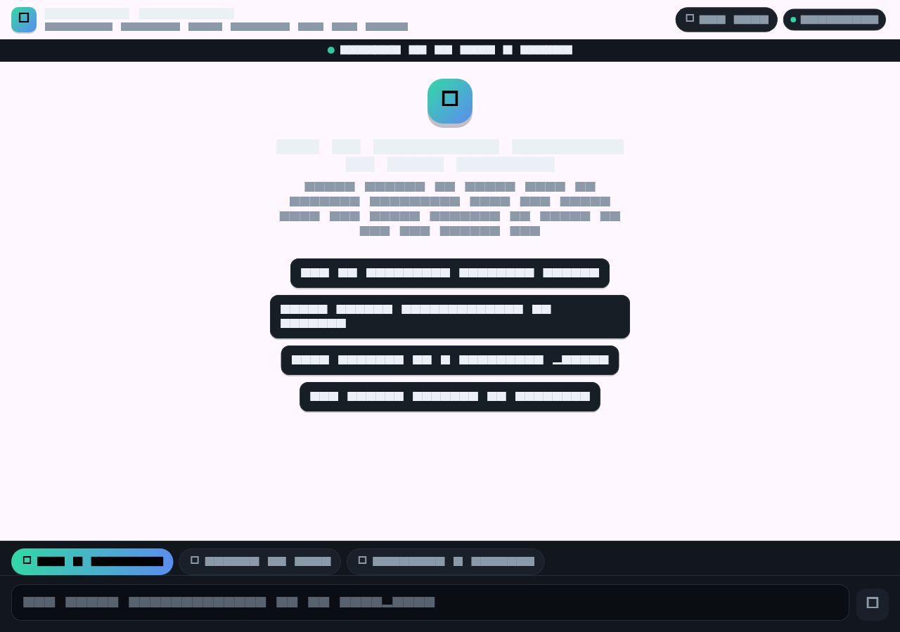
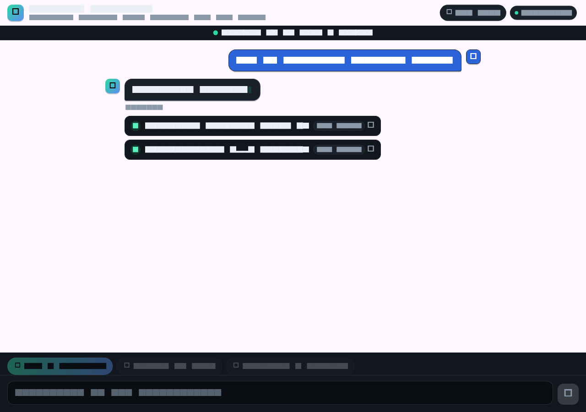

# AI-First Assistant (Flutter)

A polished, dark-themed AI chat client built in Flutter. It talks to a REST
backend over JWT auth, streams grounded answers token-by-token with a live
blinking caret, and renders expandable source citations so every claim is
verifiable. It is designed to read like a real shipped product, not a tutorial.



---

## What it demonstrates

- **Token-by-token streaming** - a live blinking caret trails the text as
  tokens arrive (Server-Sent Events). The UX auto-scrolls to follow long
  answers in real time.
- **Retrieving / latency state** - while the backend retrieves context and
  generates the first token, a three-dot animation shows "Retrieving sources
  and thinking..." so the UI never looks frozen.
- **Grounded answers with citations** - every assistant reply shows expandable
  source cards with a relevance-match percentage, so answers are traceable
  rather than a black box.
- **Transparent demo auth** - on load the app provisions a demo account
  (register-or-login), caches the JWT, and uses it for every call, so a
  visitor starts chatting with zero friction.
- **Clean architecture** - UI and state depend only on an `AiBackend`
  abstraction. The concrete `FastApiBackend` (REST + JWT + SSE) is wired in at
  exactly one place, so swapping backends is a single localized change.
- **Config-driven backend URL** - the base URL is injected at build time with
  `--dart-define`, never hardcoded.
- **Graceful error and offline states** - a banner + reconnect button when auth
  fails; an inline retry affordance on failed turns.

## Screenshots

| Welcome state | Streaming in progress | Complete answer with citations |
|---|---|---|
|  |  |  |

Screenshots generated with the real Flutter widget renderer via
`test/screenshots_test.dart` (FakeBackend, no real network).

---

## Architecture

```
lib/
  config/
    app_config.dart          Build-time config (API_BASE_URL, branding, demo creds)
  models/
    chat_message.dart        One chat turn - role, text, status (sending/streaming/complete/error)
    chat_stream_event.dart   SSE event types (ChatMetadata, ChatToken, ChatDone, ChatStreamError)
    citation.dart            One source passage with relevance score
    conversation_turn.dart   Serializable history turn for follow-up context
  services/
    ai_backend.dart          AiBackend interface (the abstraction)
    fastapi_backend.dart     FastApiBackend: REST + JWT + SSE implementation
    backend_exception.dart   UI-readable error type
  state/
    chat_controller.dart     ChangeNotifier: transcript + session state
  app/
    theme.dart               Dark product theme (single source of colour)
  ui/
    chat_screen.dart         The screen: app bar, transcript, composer
    widgets/
      chat_input.dart        Composer with Enter-to-send, auto-grow, send button
      message_bubble.dart    User/assistant bubbles, streaming caret, error + retry
      citation_card.dart     Expandable source card with relevance badge
      empty_state.dart       Welcome screen with suggestion chips
      typing_indicator.dart  Three-dot animation for the "retrieving" state
  main.dart                  Wires FastApiBackend into the app (one place)
```

Layering is strict and one-directional: `ui` and `state` depend on the
`AiBackend` interface only; nothing above the service layer knows about HTTP,
a base URL, tokens, or JSON. State management is Provider with a single
`ChatController` (`ChangeNotifier`).

---

## Backend contract

The client integrates with a FastAPI conversational service. Relevant endpoints:

- `POST /auth/register` (JSON) - provisions the demo account (201 = created, 409 = already exists).
- `POST /auth/login` (OAuth2 form fields) - returns a JWT bearer token.
- `POST /chat` (JSON, bearer token, `Accept: text/event-stream`) - streams SSE events:
  - `event: metadata` - citations array, retrieved count, model name (sent before any tokens).
  - `event: token` - one text chunk to append.
  - `event: done` - finish reason (stop or error).
  - `event: error` - error message from the language model.

The backend must allow the web origin via CORS (`CORS_ALLOW_ORIGINS`).

---

## Run it

**Prerequisites:** Flutter SDK (stable) and the backend running locally.

1. Start the backend:

   ```bash
   source .venv/bin/activate
   uvicorn app.main:app --host 127.0.0.1 --port 8000
   ```

2. Run or build the Flutter app with `--dart-define`:

   ```bash
   # Run against a local Chrome instance:
   flutter run -d chrome --dart-define=API_BASE_URL=http://127.0.0.1:8000

   # Produce a deployable web build:
   flutter build web --release --dart-define=API_BASE_URL=https://your-api.example.com
   # Output: build/web/  (serve with any static host)
   ```

   The default API_BASE_URL is `http://127.0.0.1:8000` so the define is
   optional for local dev; only required when repointing at a deployed backend.

### Configuration knobs (all via `--dart-define`)

| Key             | Default                 | Purpose                         |
| --------------- | ----------------------- | ------------------------------- |
| `API_BASE_URL`  | `http://127.0.0.1:8000` | Backend base URL                |
| `DEMO_USERNAME` | `demo_visitor`          | Transparent demo account handle |
| `DEMO_PASSWORD` | (demo default)          | Transparent demo account secret |

---

## Tests

```bash
flutter test
```

- `test/fastapi_backend_test.dart` - unit-tests the service layer (auth flow,
  bearer token, citation parsing, SSE event decoding, error and 401 handling)
  against a mocked HTTP client. Never touches a real network.
- `test/chat_widget_test.dart` - widget-tests the full chat UI with a fake
  backend: the welcome state, streaming an answer, follow-up history, the
  offline banner, and the ungrounded and error states.

To regenerate the portfolio screenshots in `docs/`:

```bash
flutter test test/screenshots_test.dart --update-goldens
```

---

## Swapping to OpenAI (future, not enabled)

Because everything above the service layer depends only on `AiBackend`,
moving to OpenAI is a single, localized change:

1. Add `OpenAiBackend implements AiBackend` alongside `FastApiBackend`.
   Its `chat()` method POSTs to the OpenAI chat-completions endpoint with
   `Authorization: Bearer <key>` and `"stream": true`, then maps SSE delta
   chunks to `ChatToken` events. The API key comes from secure config and is
   never committed.
2. Change one line in `lib/main.dart` from `FastApiBackend(...)` to
   `OpenAiBackend(...)`.

No UI, state, model, or test code changes. See `lib/services/ai_backend.dart`
for the full interface documentation and the insertion point.

---

## Notes

- No secrets are committed. Demo account credentials are non-sensitive and
  only unlock the public seed corpus.
- No paid external API is called anywhere. The only network dependency is the
  local FastAPI backend.
- Primary target is Flutter web. An Android build is possible from the same
  codebase.
